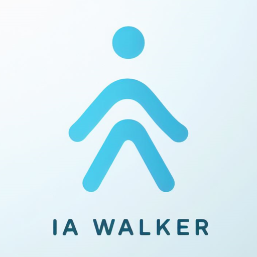
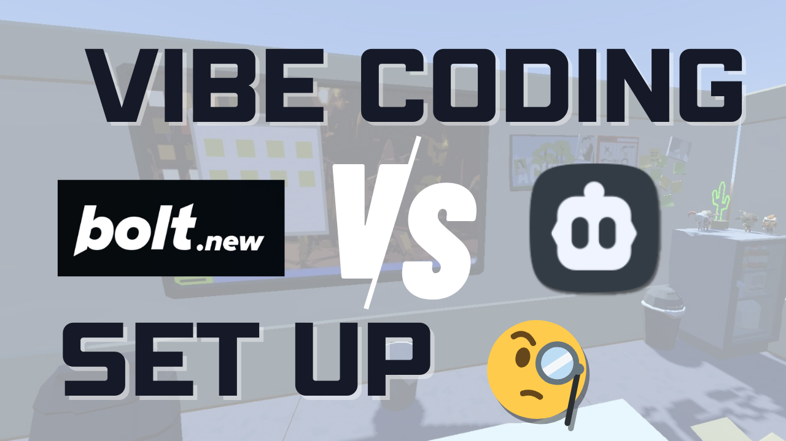
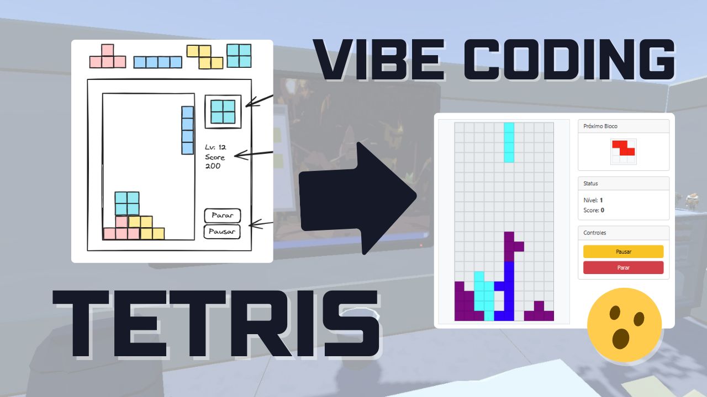

# IA Walker - Vibe Coding Repository

<p align="center">
  <a href="https://ia-walker.com.br/">IA Walker Web</a> •
  <a href="https://www.youtube.com/@ia.walker_planning_room">YouTube</a> •
  <a href="https://www.instagram.com/ia.walker/">Instagram</a>
</p>

## 📱 Bem-vindo ao Repositório de Aplicativos IA Walker!

<div>
  
  <div style="padding: 2rem">
Este repositório contém todos os aplicativos desenvolvidos durante as sessões do canal do YouTube **"IA WALKER - SALA DE PLANEJAMENTO"**. Aqui você encontrará projetos práticos, tutoriais implementados e exemplos de código que demonstram o poder da programação assistida por IA.
  </div>
</div>

## 🚀 Sobre o Projeto

O **IA Walker - Vibe Coding** é uma iniciativa que visa compartilhar conhecimento sobre desenvolvimento de software com o auxílio de inteligência artificial. Cada aplicativo neste repositório representa uma jornada de aprendizado, onde exploramos conceitos, ferramentas e técnicas modernas de programação.

## 📂 Estrutura do Repositório

Os projetos estão organizados em pastas individuais, cada uma contendo:

- Código-fonte completo do aplicativo
- Instruções de instalação e execução
- Documentação relevante
- Link para o vídeo tutorial correspondente no YouTube

## 📋 Lista de Aplicativos

| Nome do App | Links |
|-------------|---------------|
| <br /> **Comparando Bolt vs Cline: SetUp do seu #VibeCoding  [Guia 2025] #000**   | [Assistir](https://youtu.be/Hx5XbHXv5C8) |
|  <br /> **IA Codando Tetris! #VibeCoding com Svelte e Bootstrap #002** | [Assistir](https://youtu.be/6G-hWS4wBhk) |

## 🛠️ Como Usar

1. Clone este repositório:
```bash
git clone https://github.com/seu-usuario/ia-walker-vibe-coding.git
```

2. Navegue até a pasta do aplicativo desejado:
```bash
cd ia-walker-vibe-coding/nome-do-app
```

3. Siga as instruções específicas de instalação no README de cada projeto.

## 📺 Canal do YouTube

Não deixe de se inscrever no canal [IA WALKER - SALA DE PLANEJAMENTO](https://www.youtube.com/@ia.walker_planning_room) para acompanhar todos os episódios e aprender como cada um desses aplicativos foi desenvolvido do zero!

## 👥 Contribuição

Sinta-se à vontade para:
- Sugerir melhorias
- Enviar pull requests

Consulte o arquivo CONTRIBUTING.md para mais detalhes sobre como contribuir.

## 📄 Licença

Este projeto está licenciado sob a Licença MIT - veja o arquivo [LICENSE](LICENSE) para detalhes.

## 🙏 Agradecimentos

Um agradecimento especial a todos os inscritos e participantes da comunidade IA Walker que tornam este projeto possível!